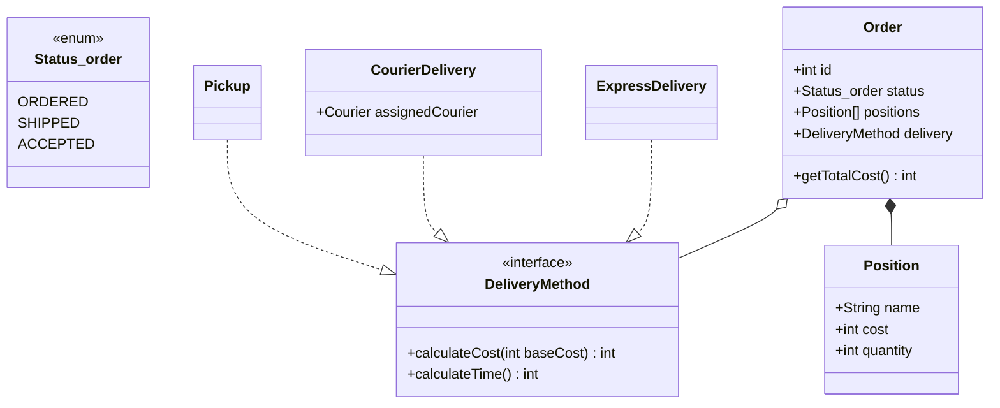

```mermaid
classDiagram
    %% Перечисление для статусов заказа
    class Status_order {
        <<enum>>
        ORDERED
        SHIPPED
        ACCEPTED
    }

    %% Класс для одной позиции в чеке (товар, цена, количество)
    class Position {
        +String name
        +int cost
        +int quantity
    }

    %% Интерфейс, задающий общий контракт для всех типов доставки
    class DeliveryMethod {
        <<interface>>
        +calculateCost(int baseCost) int
        +calculateTime() int
    }

    %% Реализация самовывоза (бесплатно)
    class Pickup {
    }
    
    %% Реализация обычной доставки курьером
    class CourierDelivery {
        +Courier assignedCourier
    }
    
    %% Реализация быстрой экспресс-доставки (дороже)
    class ExpressDelivery {
    }

    %% Основной класс заказа, который объединяет в себе все данные
    class Order {
        +int id
        +Status_order status
        +Position[] positions
        +DeliveryMethod delivery
        +getTotalCost() int
    }

    %% Указание, что классы способов доставки реализуют общий интерфейс
    Pickup ..|> DeliveryMethod
    CourierDelivery ..|> DeliveryMethod
    ExpressDelivery ..|> DeliveryMethod

    %% Заказ жестко включает в себя позиции (композиция)
    Order *-- Position
    
    %% Заказ ссылается на выбранный способ доставки (агрегация)
    Order o-- DeliveryMethod
```
