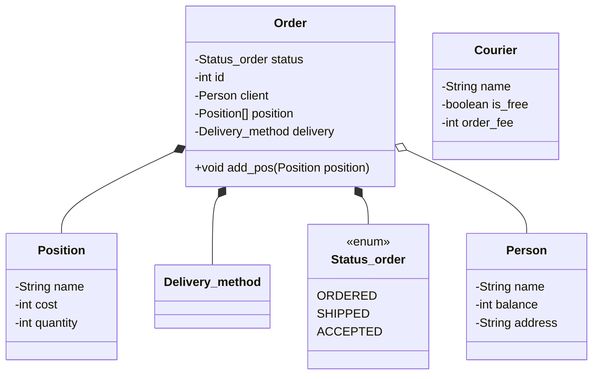

```mermaid
classDiagram
   %% Перечисление статусов (Statuses)
    class Status_order{
        <<enum>>
        ORDERED
        SHIPPED
        ACCEPTED
    }
    %% Позиция заказа (Position)
    class Position{
        -String name
        -int cost
        -int quantity
   }
   %% Клиент (Person)
   class Person{
       -String name
       -int balance
       -String address
   }
   %% Заказ (Order)
   class Order {
      -Status_order status
      -int id
      -Person client
      -Position[] position
      -Delivery_method delivery
      +void add_pos(Position position)
         %%Добавляет позицию в заказ
   }
   %% Курьер (Courier)
   class Courier {
      -String name
      -boolean is_free
         %%Статус незанятости (true-свободен, false-занят)
      -int order_fee
         %%Зарплата за заказ
   }

   Order *-- Position
   Order *-- Delivery_method
   Order *-- Status_order
   Order o-- Person
```
