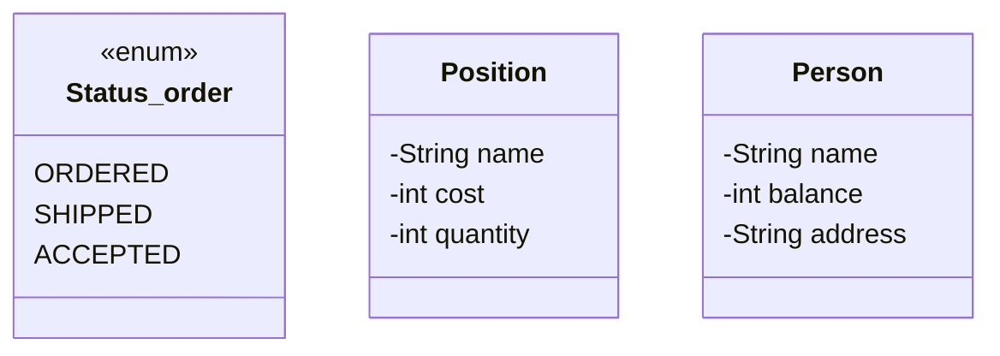

```mermaid
classDiagram
   %% Перечисление статусов (Statuses)
    class Status_order{
        <<enum>>
        ORDERED
        SHIPPED
        ACCEPTED
    }
    %% Позиция заказа (Position)
    class Position{
        -String name
        -int cost
        -int quantity
   }
   %% Клиент (Person)
   class Person{
       -String name
       -int balance
       -String address
   }
```
