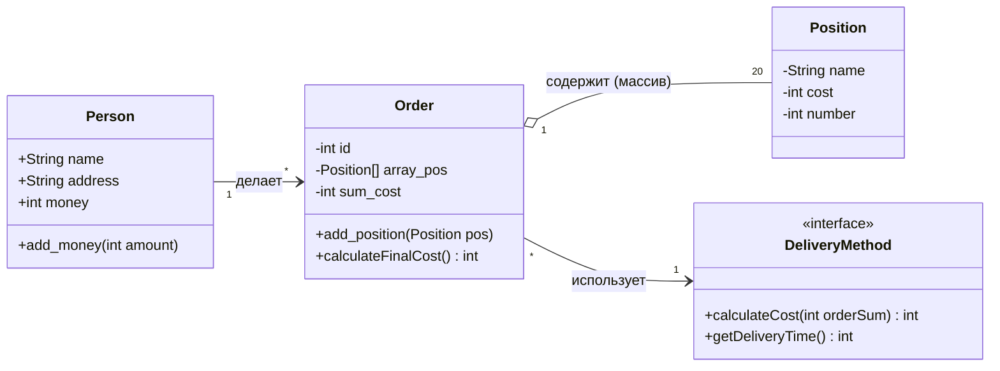

```mermaid
classDiagram
    direction LR
    class Person {
        +String name
        +String address
        +int money
        +add_money(int amount)
    }
    class Order {
        -int id
        -Position[] array_pos
        -int sum_cost
        +add_position(Position pos)
        +calculateFinalCost() int
    }
    class Position {
        -String name
        -int cost
        -int number
    }
    class DeliveryMethod {
        <<interface>>
        +calculateCost(int orderSum) int
        +getDeliveryTime() int
    }

    Person "1" --> "*" Order : делает
    Order "1" o-- "20" Position : содержит (массив)
    Order "*" --> "1" DeliveryMethod : использует
```
