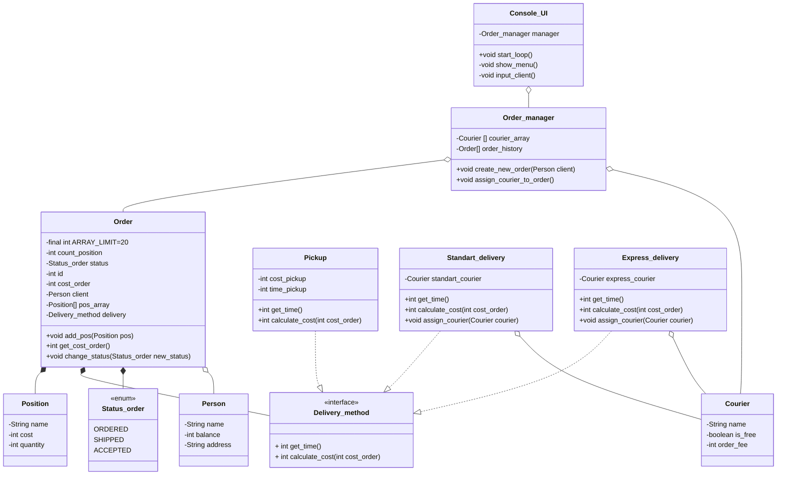

```mermaid
classDiagram
   %% Перечисление статусов (Statuses)
    class Status_order{
        <<enum>>
        ORDERED
        SHIPPED
        ACCEPTED
    }
    %% Позиция заказа (Position)
    class Position{
        -String name
        -int cost
        -int quantity
   }
   %% Клиент (Person)
   class Person{
       -String name
       -int balance
       -String address
   }
   %% Заказ (Order)
   class Order {
      -final int ARRAY_LIMIT=20
      -int count_position
      -Status_order status
      -int id
      -int cost_order
      -Person client
      -Position[] pos_array
      -Delivery_method delivery
      +void add_pos(Position pos)
         %%Добавляет позицию в заказ
      +int get_cost_order()
         %%Считает стоимость всего заказа
      +void change_status(Status_order new_status)
   }
   %% Курьер (Courier)
   class Courier {
      -String name
      -boolean is_free
         %%Статус незанятости (true-свободен, false-занят)
      -int order_fee
         %%Зарплата за заказ
   }
   %% Интерфейс доставки (Delivery_method)
   class Delivery_method {
      <<interface>>
      + int get_time()
      + int calculate_cost (int cost_order)
   }
   %% Самовывоз (Pickup)
   class Pickup{
      -int cost_pickup
      -int time_pickup
      +int get_time()
      +int calculate_cost (int cost_order)
   }
   %% Стандартная доставка (Standart_delivery)
   class Standart_delivery {
      -Courier standart_courier
         %% Изначально может быть null
      +int get_time()
      +int calculate_cost (int cost_order)
      +void assign_courier(Courier courier)
   }
   %% Экспресс доставка (Express_delivery)
   class Express_delivery {
      -Courier express_courier
         %% Изначально может быть null
      +int get_time()
      +int calculate_cost (int cost_order)
      +void assign_courier(Courier courier)
   }
   %% Менеджер заказов (Order_manager)
   class Order_manager {
      -Courier [] courier_array
      -Order[] order_history
         %% Хранилище всех заказов системы
      +void create_new_order(Person client)
         %%Создаёт новый заказ (Order), и кладёт его в order_history
      +void assign_courier_to_order()
   }

   %% Пользовательский интерфейс (Console_UI)
   class Console_UI{
      -Order_manager manager
      +void start_loop()
         %% Запускает цикл меню (использует show_menu(), )
      -void show_menu()
         %% Показывает всю видимую часть интерфейса
      -void input_client()
         %% Обрабатывает все вводы клиента
         }
   
   %% Связи заказа
   Order *-- Position
   Order *-- Delivery_method
   Order *-- Status_order
   Order o-- Person

   %% Реализация интерфейса доставки
   Pickup ..|> Delivery_method
   Standart_delivery ..|> Delivery_method
   Express_delivery ..|> Delivery_method

   %% Связи методов доставки 
   Standart_delivery o-- Courier
   Express_delivery o-- Courier

   %% Связи главного управляющего класса (Order_manager)
   Order_manager o-- Order 
   Order_manager o-- Courier 

   %% Связь пользовательского интерфейса (Console_UI)
   Console_UI o-- Order_manager
```
